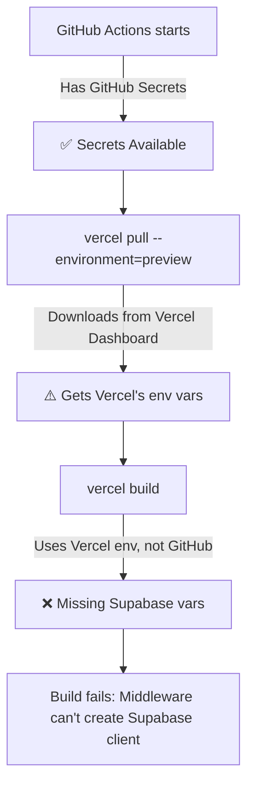

# Environment Variables & GitHub Actions Fix

## The Root Cause

Your Playwright tests are failing because of a **Vercel + GitHub Actions environment variable mismatch**:

1. **GitHub has your secrets** ✅
2. **Vercel might not have them** ❓  
3. **`vercel build` uses Vercel's env, not GitHub's** ❌

## The Problem Flow



## Solutions (in order of preference)

### Option 1: Add to Vercel Dashboard (Simplest)

1. Go to: https://vercel.com/[your-username]/[your-project]/settings/environment-variables
2. Add these variables for **Preview** environment:
   - `NEXT_PUBLIC_SUPABASE_URL` = (your Supabase URL)
   - `NEXT_PUBLIC_SUPABASE_ANON_KEY` = (your Supabase anon key)
   - `NEXT_PUBLIC_OPENWEATHER_API_KEY` = (your OpenWeather key)

### Option 2: Use Updated Workflows (Already Implemented)

The workflows have been updated to create a combined environment file that:
- Starts with Vercel's environment (if it exists)
- Overlays GitHub secrets on top (these win)
- Creates `.env.production.local` before building

### Option 3: Debug and Fix

1. **Test your environment locally:**
   ```bash
   npm run test:env
   ```

2. **Check what GitHub Actions sees:**
   ```bash
   # Push the debug workflow
   git add .github/workflows/debug-env.yml
   git commit -m "Add environment debug workflow"
   git push
   
   # Go to GitHub Actions tab
   # Run "Debug Environment Variables" workflow manually
   ```

3. **Verify secret names are EXACT:**
   - Case matters: `NEXT_PUBLIC_SUPABASE_URL` not `next_public_supabase_url`
   - No quotes in values: `https://abc.supabase.co` not `"https://abc.supabase.co"`
   - No trailing spaces

## Quick Fixes Applied

### 1. Middleware now handles missing env gracefully:
```typescript
if (!process.env.NEXT_PUBLIC_SUPABASE_URL || !process.env.NEXT_PUBLIC_SUPABASE_ANON_KEY) {
  console.warn('[Middleware] Supabase not configured, skipping auth checks');
  return NextResponse.next();
}
```

### 2. Workflows create combined env files:
```yaml
# GitHub secrets override Vercel's env
echo "NEXT_PUBLIC_SUPABASE_URL=${{ secrets.NEXT_PUBLIC_SUPABASE_URL }}" >> .env.production.local
```

### 3. Fallback values prevent crashes:
```typescript
const url = process.env.NEXT_PUBLIC_SUPABASE_URL || 'https://placeholder.supabase.co'
const key = process.env.NEXT_PUBLIC_SUPABASE_ANON_KEY || 'placeholder-key'
```

## Action Items

1. **Immediate**: Run `npm run test:env` to check your local setup
2. **Quick Win**: Add variables to Vercel dashboard (5 minutes)
3. **Verify**: Push changes and run debug workflow
4. **Monitor**: Check if next PR's tests pass

## Expected GitHub Secrets

Make sure these exist in Settings → Secrets → Actions:

| Secret Name | Required | Used For |
|------------|----------|----------|
| `NEXT_PUBLIC_SUPABASE_URL` | Yes | Supabase connection |
| `NEXT_PUBLIC_SUPABASE_ANON_KEY` | Yes | Supabase auth |
| `NEXT_PUBLIC_OPENWEATHER_API_KEY` | Yes | Weather data |
| `VERCEL_TOKEN` | For Vercel tests | Vercel deployment |
| `VERCEL_ORG_ID` | For Vercel tests | Vercel org |
| `VERCEL_PROJECT_ID` | For Vercel tests | Vercel project |

## Testing Commands

```bash
# Check environment setup
npm run test:env

# Run Playwright tests locally
npm run test:e2e

# Debug tests with UI
npm run test:e2e:ui

# Windows users
run-tests.cmd

# Mac/Linux users
./run-tests.sh
```

## Why This Happens

Next.js needs environment variables at **build time** for:
- Server-side code (middleware, API routes)
- Client-side code prefixed with `NEXT_PUBLIC_`

When Vercel builds, it only sees what `vercel pull` downloaded from Vercel's dashboard, not GitHub secrets, unless we explicitly pass them.

## Success Criteria

✅ Tests pass in GitHub Actions
✅ No Supabase client errors in logs
✅ Weather functionality works (even without auth)
✅ All three workflows succeed (e2e-local, playwright, e2e-preview)
